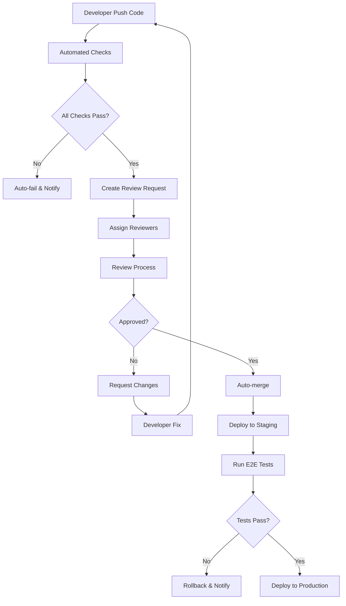

# 🔍 Code Review Workflow - SprintFlow

## 📋 Tổng quan

Workflow review code hiện đại tích hợp với Git và tự động hóa quy trình kiểm tra, review, và merge code. Hệ thống này đảm bảo chất lượng code và tăng tốc độ development.

---

## 🔄 Workflow Overview

### **1. Automated Code Review Pipeline**



---

## 🛠️ Automated Checks

### **Pre-Review Automation**

#### **1. Code Quality Checks**
```yaml
# .github/workflows/code-quality.yml
name: Code Quality Check

on: [pull_request]

jobs:
  lint:
    runs-on: ubuntu-latest
    steps:
      - name: ESLint Check
        run: npm run lint
      
      - name: TypeScript Check
        run: npm run type-check
      
      - name: Prettier Check
        run: npm run format:check
      
      - name: Security Scan
        run: npm audit
```

#### **2. Test Coverage**
```yaml
  test-coverage:
    runs-on: ubuntu-latest
    steps:
      - name: Run Tests
        run: npm run test:coverage
      
      - name: Check Coverage
        run: |
          if [ $(npm run test:coverage | grep -o '[0-9]*%' | head -1 | sed 's/%//') -lt 80 ]; then
            echo "Test coverage below 80%"
            exit 1
          fi
```

#### **3. Performance Checks**
```yaml
  performance:
    runs-on: ubuntu-latest
    steps:
      - name: Bundle Size Check
        run: npm run build:analyze
      
      - name: Lighthouse CI
        run: npm run lighthouse
```

---

## 👥 Review Process

### **1. Smart Reviewer Assignment**

```typescript
interface ReviewerAssignment {
  // Auto-assign based on file changes
  fileOwners: {
    'src/modules/auth/**': ['auth-team-lead'],
    'src/modules/projects/**': ['project-manager'],
    'src/components/**': ['ui-lead'],
    'src/api/**': ['backend-lead']
  },
  
  // Auto-assign based on code complexity
  complexityThreshold: {
    high: ['senior-dev', 'tech-lead'],
    medium: ['mid-level-dev'],
    low: ['junior-dev']
  },
  
  // Auto-assign based on project
  projectReviewers: {
    'project-id': ['project-manager', 'tech-lead']
  }
}
```

### **2. Review Checklist**

#### **Code Quality Checklist**
- [ ] **TypeScript**: No `any` types, proper interfaces
- [ ] **Naming**: Clear, descriptive names
- [ ] **Functions**: Single responsibility, max 20 lines
- [ ] **Error Handling**: Proper try-catch, error boundaries
- [ ] **Performance**: No unnecessary re-renders, optimizations
- [ ] **Security**: Input validation, XSS prevention
- [ ] **Accessibility**: ARIA labels, keyboard navigation

#### **Architecture Checklist**
- [ ] **Separation of Concerns**: Logic properly separated
- [ ] **Reusability**: Components are reusable
- [ ] **Testing**: Unit tests for business logic
- [ ] **Documentation**: Code comments, API docs
- [ ] **Dependencies**: No unnecessary dependencies

#### **UI/UX Checklist**
- [ ] **Responsive**: Works on all screen sizes
- [ ] **Accessibility**: WCAG 2.1 compliance
- [ ] **Performance**: Fast loading, smooth interactions
- [ ] **Consistency**: Follows design system
- [ ] **User Experience**: Intuitive, user-friendly

---

## 🤖 Automated Review Tools

### **1. AI-Powered Code Review**

```typescript
interface AICodeReview {
  // Automated suggestions
  suggestions: {
    performance: string[],
    security: string[],
    bestPractices: string[],
    refactoring: string[]
  },
  
  // Code complexity analysis
  complexity: {
    cyclomaticComplexity: number,
    cognitiveComplexity: number,
    maintainabilityIndex: number
  },
  
  // Security vulnerability scan
  security: {
    vulnerabilities: SecurityIssue[],
    riskLevel: 'low' | 'medium' | 'high'
  }
}
```

### **2. Automated Testing**

```yaml
# Automated test scenarios
test-scenarios:
  - name: "Critical User Flows"
    tests:
      - "User authentication flow"
      - "Project creation flow"
      - "Task assignment flow"
      - "File upload flow"
  
  - name: "Edge Cases"
    tests:
      - "Invalid input handling"
      - "Network error handling"
      - "Concurrent user actions"
      - "Large data sets"
  
  - name: "Performance Tests"
    tests:
      - "Page load time < 2s"
      - "API response time < 500ms"
      - "Memory usage optimization"
      - "Bundle size < 500KB"
```

---

## 📊 Review Metrics & Analytics

### **1. Review Performance Metrics**

```typescript
interface ReviewMetrics {
  // Time metrics
  timeToFirstReview: number, // hours
  timeToApproval: number,    // hours
  timeToMerge: number,       // hours
  
  // Quality metrics
  reviewComments: number,
  requestedChanges: number,
  approvalRate: number,      // percentage
  
  // Reviewer metrics
  reviewerResponseTime: number,
  reviewerWorkload: number,
  reviewerQuality: number    // based on feedback
}
```

### **2. Code Quality Trends**

```typescript
interface QualityTrends {
  // Over time metrics
  bugRate: number[],         // bugs per 1000 lines
  technicalDebt: number[],   // technical debt score
  testCoverage: number[],    // percentage
  performanceScore: number[] // lighthouse score
  
  // Team metrics
  teamVelocity: number,      // story points per sprint
  codeReviewEfficiency: number,
  knowledgeSharing: number
}
```

---

## 🔄 Integration with SprintFlow

### **1. Issue Integration**

```typescript
interface IssueIntegration {
  // Auto-link PR to issues
  issueLinks: {
    pattern: 'fixes #123|closes #123|resolves #123',
    autoLink: boolean,
    autoClose: boolean
  },
  
  // Auto-update issue status
  statusUpdates: {
    'in-review': 'PR created and under review',
    'approved': 'PR approved, ready for merge',
    'merged': 'Issue completed and deployed'
  },
  
  // Auto-add work summary
  workSummary: {
    autoGenerate: boolean,
    includeFiles: boolean,
    includeMetrics: boolean
  }
}
```

### **2. Notification System**

```typescript
interface ReviewNotifications {
  // Real-time notifications
  notifications: {
    'review-requested': NotificationConfig,
    'review-completed': NotificationConfig,
    'changes-requested': NotificationConfig,
    'pr-merged': NotificationConfig
  },
  
  // Notification channels
  channels: {
    email: boolean,
    slack: boolean,
    inApp: boolean,
    push: boolean
  }
}
```

---

## 🚀 Advanced Features

### **1. Smart Merge Strategies**

```yaml
# Merge strategies based on PR type
merge-strategies:
  feature:
    method: "squash"
    auto-delete-branch: true
    require-approval: 2
  
  bugfix:
    method: "merge"
    auto-delete-branch: true
    require-approval: 1
  
  hotfix:
    method: "rebase"
    auto-delete-branch: true
    require-approval: 1
    bypass-checks: false
```

### **2. Automated Deployment**

```yaml
# Deployment pipeline
deployment:
  staging:
    auto-deploy: true
    tests: ["unit", "integration", "e2e"]
    approval: false
  
  production:
    auto-deploy: false
    tests: ["unit", "integration", "e2e", "performance"]
    approval: true
    rollback: true
```

### **3. Code Review Templates**

```markdown
## Code Review Template

### 📋 Review Checklist
- [ ] Code follows project conventions
- [ ] All tests pass
- [ ] No security vulnerabilities
- [ ] Performance impact assessed
- [ ] Documentation updated

### 🔍 Review Focus Areas
- **Functionality**: Does the code work as expected?
- **Performance**: Any performance implications?
- **Security**: Any security concerns?
- **Maintainability**: Is the code maintainable?
- **Testing**: Are there sufficient tests?

### 💬 Feedback Guidelines
- Be constructive and specific
- Focus on the code, not the person
- Suggest improvements, not just problems
- Use positive language when possible
```

---

## 📈 Continuous Improvement

### **1. Review Process Optimization**

```typescript
interface ProcessOptimization {
  // Identify bottlenecks
  bottlenecks: {
    slowReviewers: string[],
    complexPRs: string[],
    frequentIssues: string[]
  },
  
  // Suggest improvements
  improvements: {
    reviewerTraining: string[],
    processChanges: string[],
    toolUpgrades: string[]
  },
  
  // Track effectiveness
  effectiveness: {
    reviewQuality: number,
    developerSatisfaction: number,
    timeToMarket: number
  }
}
```

### **2. Learning & Development**

```typescript
interface LearningProgram {
  // Code review training
  training: {
    bestPractices: string[],
    commonMistakes: string[],
    reviewTechniques: string[]
  },
  
  // Knowledge sharing
  knowledgeSharing: {
    reviewSessions: boolean,
    pairProgramming: boolean,
    codeWalkthroughs: boolean
  },
  
  // Mentorship
  mentorship: {
    seniorJuniors: boolean,
    crossTeamReview: boolean,
    externalExperts: boolean
  }
}
```

---

## 🎯 Success Metrics

### **Target Metrics**
- **Review Time**: < 24 hours for first review
- **Approval Rate**: > 90% of PRs approved
- **Bug Rate**: < 5 bugs per 1000 lines of code
- **Developer Satisfaction**: > 4.5/5 rating
- **Time to Market**: 20% faster than before

### **Quality Gates**
- **Test Coverage**: > 80%
- **Performance**: No regression > 5%
- **Security**: Zero high-risk vulnerabilities
- **Accessibility**: WCAG 2.1 AA compliance

---

*Workflow này sẽ được cập nhật và tối ưu hóa liên tục dựa trên feedback và metrics.* 