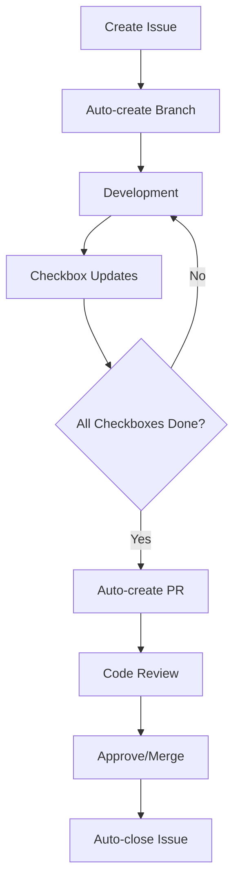
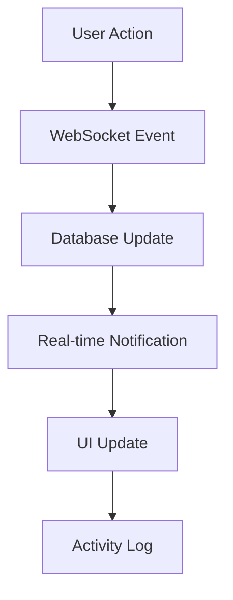
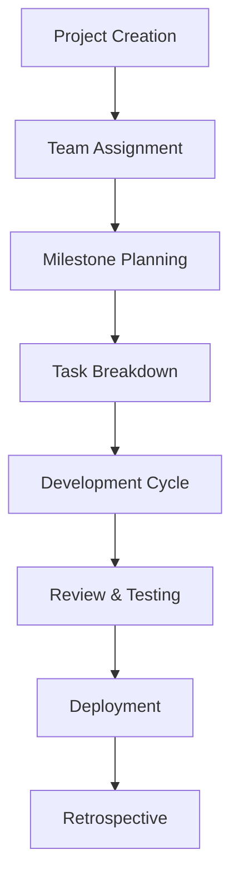

# 🚀 SprintFlow - Modern Project Management Roadmap

## 📋 Tổng quan dự án

**SprintFlow** là một hệ thống quản lý dự án hiện đại, được thiết kế đặc biệt cho các nhóm phát triển phần mềm. Hệ thống tích hợp các workflow tự động, real-time collaboration, và UX/UI hiện đại để tối ưu hóa quy trình làm việc.

### 🎯 Mục tiêu chính
- **Workflow tự động**: Tích hợp với Git để tự động tracking và PR creation
- **Real-time collaboration**: WebSocket cho instant updates và chat
- **Modern UX/UI**: Responsive design với reusable components
- **Performance tối ưu**: Caching, lazy loading, và optimization
- **Scalable architecture**: Microservices ready với Docker

---

## 🏗️ Kiến trúc hệ thống

### **Backend Architecture (NestJS)**
```
├── Core Modules
│   ├── Auth (JWT + Session)
│   ├── Users (Role-based: Admin/Manager/Member)
│   ├── Projects (Advanced workflow)
│   ├── Tasks (Kanban + Git integration)
│   ├── Milestones (Timeline management)
│   └── Attachments (File management)
├── Advanced Modules
│   ├── Notifications (Real-time + Email)
│   ├── Chat (WebSocket)
│   ├── Analytics (Reports + Metrics)
│   ├── Audit (Logging + Tracking)
│   └── Export (PDF/Excel/CSV)
└── Infrastructure
    ├── WebSocket Gateway
    ├── File Upload Service
    ├── Email Service
    └── Backup Service
```

### **Frontend Architecture (Next.js 15)**
```
├── Design System
│   ├── Components (Reusable UI)
│   ├── Layouts (Responsive containers)
│   ├── Hooks (Custom logic)
│   └── Utils (Helper functions)
├── Features
│   ├── Dashboard (Analytics + Overview)
│   ├── Projects (Management + Timeline)
│   ├── Tasks (Kanban + Git integration)
│   ├── Chat (Real-time messaging)
│   └── Reports (Analytics + Export)
└── Infrastructure
    ├── State Management (SWR + Context)
    ├── Real-time (WebSocket)
    ├── File handling
    └── Export functionality
```

---

## 🔄 Workflow hiện đại

### **1. Git-Integrated Development Workflow**



**Tính năng chính:**
- **Auto-branch creation** từ issue
- **Checkbox tracking** trong code commits
- **Automatic PR creation** khi hoàn thành
- **Detailed PR description** với work summary
- **Issue auto-closing** sau merge

### **2. Real-time Collaboration Workflow**



**Tính năng chính:**
- **Live updates** cho tất cả actions
- **Instant notifications** cho team members
- **Activity feed** real-time
- **Presence indicators** (online/offline)
- **Typing indicators** trong chat

### **3. Project Management Workflow**



---

## 👥 Role-based Access Control

### **Admin Role**
- **System management**: User management, system settings
- **Project oversight**: View all projects, analytics
- **Security**: Audit logs, backup management
- **Integration**: API management, webhook configuration

### **Manager Role**
- **Project management**: Create, edit, delete projects
- **Team management**: Assign members, manage permissions
- **Resource allocation**: Budget, timeline management
- **Reporting**: Generate reports, analytics

### **Member Role**
- **Task execution**: Create, update, complete tasks
- **Collaboration**: Comment, chat, file sharing
- **Time tracking**: Log hours, update progress
- **Personal dashboard**: View assigned tasks, calendar

---

## 🎨 Design System & UX/UI

### **Component Library**
```
├── Atoms
│   ├── Button (Primary, Secondary, Icon)
│   ├── Input (Text, Select, Date, File)
│   ├── Badge (Status, Priority, Role)
│   └── Icon (Custom icon set)
├── Molecules
│   ├── Card (Project, Task, User)
│   ├── Modal (Dialog, Drawer, Popover)
│   ├── Form (Validation, Error handling)
│   └── Navigation (Breadcrumb, Pagination)
├── Organisms
│   ├── Header (Search, Notifications, Profile)
│   ├── Sidebar (Navigation, Filters)
│   ├── DataGrid (Sortable, Filterable, Exportable)
│   └── Kanban (Drag & Drop, Swimlanes)
└── Templates
    ├── Dashboard Layout
    ├── Project Detail
    ├── Task Management
    └── User Profile
```

### **Responsive Design**
- **Mobile-first** approach
- **Breakpoints**: xs(0px), sm(600px), md(900px), lg(1200px), xl(1536px)
- **Touch-friendly** interactions
- **Progressive enhancement**

### **Theme System**
- **Light/Dark mode** toggle
- **Custom color palette**
- **Typography scale**
- **Spacing system**

---

## 🔧 Technical Implementation

### **Phase 1: Foundation (Weeks 1-4)**
- [ ] **Design System Setup**
  - [ ] Component library foundation
  - [ ] Theme system implementation
  - [ ] Responsive layout components
- [ ] **Authentication Enhancement**
  - [ ] Role-based guards
  - [ ] Session management
  - [ ] Password reset flow
- [ ] **Database Optimization**
  - [ ] Indexing strategy
  - [ ] Backup system
  - [ ] Audit logging

### **Phase 2: Core Features (Weeks 5-8)**
- [ ] **Project Management**
  - [ ] Advanced project workflow
  - [ ] Milestone management
  - [ ] Team collaboration
- [ ] **Task Management**
  - [ ] Kanban board
  - [ ] Git integration
  - [ ] Time tracking
- [ ] **Real-time Features**
  - [ ] WebSocket implementation
  - [ ] Live notifications
  - [ ] Activity feed

### **Phase 3: Advanced Features (Weeks 9-12)**
- [ ] **Chat System**
  - [ ] Real-time messaging
  - [ ] File sharing
  - [ ] Message history
- [ ] **Analytics & Reports**
  - [ ] Dashboard widgets
  - [ ] Custom reports
  - [ ] Export functionality
- [ ] **Integration**
  - [ ] Git webhooks
  - [ ] Email notifications
  - [ ] API documentation

### **Phase 4: Optimization (Weeks 13-16)**
- [ ] **Performance**
  - [ ] Caching strategy
  - [ ] Lazy loading
  - [ ] Bundle optimization
- [ ] **Testing**
  - [ ] Unit tests
  - [ ] Integration tests
  - [ ] E2E tests
- [ ] **Deployment**
  - [ ] CI/CD pipeline
  - [ ] Docker optimization
  - [ ] Monitoring setup

---

## 🚀 CI/CD Pipeline

### **Automated Workflow**
```yaml
# .github/workflows/ci-cd.yml
name: SprintFlow CI/CD

on:
  push:
    branches: [main, develop]
  pull_request:
    branches: [main]

jobs:
  test:
    runs-on: ubuntu-latest
    steps:
      - Checkout code
      - Setup Node.js
      - Install dependencies
      - Run tests
      - Code coverage
      - Security scan

  build:
    needs: test
    runs-on: ubuntu-latest
    steps:
      - Build frontend
      - Build backend
      - Docker image creation
      - Push to registry

  deploy:
    needs: build
    runs-on: ubuntu-latest
    steps:
      - Deploy to staging
      - Run smoke tests
      - Deploy to production
```

### **Git Integration Features**
- **Issue tracking** với commit messages
- **Automatic PR creation** từ completed issues
- **Code review** workflow
- **Deployment automation**

---

## 📊 Analytics & Reporting

### **Dashboard Metrics**
- **Project health** indicators
- **Team velocity** tracking
- **Time tracking** analytics
- **Resource utilization**
- **Quality metrics** (bugs, issues)

### **Export Capabilities**
- **PDF reports** với charts
- **Excel exports** cho data analysis
- **CSV exports** cho external tools
- **Custom report builder**

---

## 🔒 Security & Compliance

### **Security Features**
- **JWT token** rotation
- **Rate limiting** cho API
- **Input validation** và sanitization
- **SQL injection** prevention
- **XSS protection**

### **Audit & Compliance**
- **User activity** logging
- **Data access** tracking
- **Change history** cho all entities
- **Backup** automation
- **Data retention** policies

---

## 📱 Mobile & Accessibility

### **Mobile Features**
- **Progressive Web App** (PWA)
- **Offline capability**
- **Push notifications**
- **Touch gestures**

### **Accessibility**
- **WCAG 2.1** compliance
- **Keyboard navigation**
- **Screen reader** support
- **High contrast** mode

---

## 🔄 Real-time Features

### **WebSocket Events**
```typescript
// Real-time events
interface WebSocketEvents {
  // Project events
  'project:created': ProjectData
  'project:updated': ProjectData
  'project:deleted': ProjectId
  
  // Task events
  'task:created': TaskData
  'task:updated': TaskData
  'task:moved': TaskMoveData
  
  // Chat events
  'chat:message': ChatMessage
  'chat:typing': TypingData
  
  // User events
  'user:online': UserId
  'user:offline': UserId
}
```

### **Notification System**
- **In-app notifications**
- **Email notifications**
- **Push notifications**
- **Custom notification rules**

---

## 🎯 Success Metrics

### **Performance Targets**
- **Page load time**: < 2 seconds
- **API response time**: < 500ms
- **Real-time latency**: < 100ms
- **Uptime**: 99.9%

### **User Experience**
- **User adoption**: > 80% trong 3 tháng
- **Task completion rate**: > 90%
- **User satisfaction**: > 4.5/5
- **Mobile usage**: > 40%

---

## 📈 Future Roadmap

### **Phase 5: AI Integration (Future)**
- **Smart task assignment**
- **Predictive analytics**
- **Automated reporting**
- **Natural language processing**

### **Phase 6: Enterprise Features (Future)**
- **SSO integration**
- **Advanced permissions**
- **Multi-tenant support**
- **Custom workflows**

---

## 🛠️ Development Guidelines

### **Code Quality**
- **TypeScript** strict mode
- **ESLint** + **Prettier**
- **Conventional commits**
- **Code review** required

### **Testing Strategy**
- **Unit tests**: > 80% coverage
- **Integration tests**: API endpoints
- **E2E tests**: Critical user flows
- **Performance tests**: Load testing

### **Documentation**
- **API documentation** (Swagger)
- **Component documentation** (Storybook)
- **User guides** và tutorials
- **Developer documentation**

---

*Roadmap này sẽ được cập nhật thường xuyên dựa trên feedback và yêu cầu mới.* 